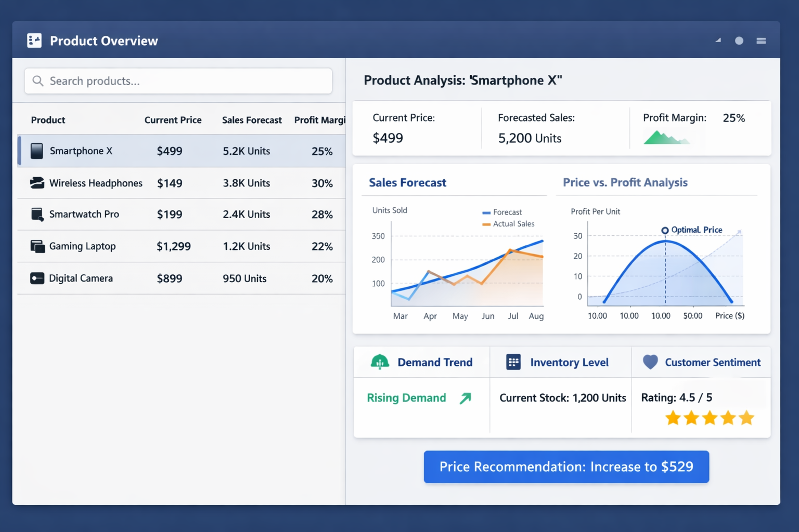

# Backend-Performance in High-Throughput Systems - A Data Engineer's Perspective
Throughout my career in IT consulting, I have seen this pattern repeat itself over and over again:
Many high-load systems start out as small, inconspicuous prototypes.

In their early stages—when fundamental decisions about architecture, technologies, and design are made—the scale at which 
these systems will eventually operate is often ignored or simply impossible to anticipate.

As a result, they are typically built using the default patterns of traditional backend development:

- a relational database with a highly normalized data model,
- an imperative, deterministic, object-oriented codebase,
- row-wise, case-by-case business logic,
- and a request–response architecture exposed via REST APIs and optimized for minimal latency.

These defaults exist for good reasons, and in many scenarios they work extremely well. However, some systems—especially 
those facing massive data volumes or extreme request rates—are better served by a fundamentally different approach.

In this article, we will explore how to identify such systems and how backend developers can address performance challenges 
in high-throughput environments by deliberately breaking away from their default mental models. 
In particular, we will examine how core principles and technologies from the field of data engineering—such as batch 
processing, declarative computation, and denormalized data models—can be applied to build backend systems with 
near-unbounded scalability.

## Meet Aunt Emma
Let us begin with an imaginary example, heavily inspired by real-world experiences from my own work.

Imagine our Aunt Emma running a small business: one store, two employees, and only a handful of different products—nothing fancy. For many of her day-to-day business decisions, she relies on KPIs, sales forecasts, and price recommendations generated by quantitative business models.

Calculating all of this by hand—or with limited Excel skills—is tedious and error-prone. So, being the helpful niece or nephew that we are, we decide to automate the process by building a small web application.

You can imagine the UI looking roughly like this (thanks, ChatGPT!):

Conceptually, the UI consists of two main components:

- An overview listing all sold products with some preview metrics (left side),
- A detailed view showing all available KPIs and data for a selected product (right side).

Our first step is to choose an appropriate architecture. We settle on what I would call a simple but reasonable approach:

- How Aunt Emma stores her raw data does not matter for now. For the sake of simplicity, we also ignore how the data is ingested into our system. Whether it is streamed in real time via Kafka or delivered once per day by a carrier pigeon as a CSV file on a USB stick does not matter here. 
- The first concrete decision, then, is how to store the data. Naturally, we default to a normalized data model in a relational database. Given what we know at this point, this is a perfectly reasonable choice.
- On top of that, we introduce two backend services. The first one is the Pricing Engine, where all calculations and business logic live. The second is a generic Backend service, responsible for authentication, session and user management, and for orchestrating requests to the pricing engine. We already anticipate that these two services will have very different scaling characteristics, which is why we design them as separate components.
- Finally, we build a frontend that provides the user interface shown above.

\**Of course, it does not matter which programming language we use to implement these services. I happened to pick Java here, simply because it represents a traditional, best-practice-oriented style of software development particularly well in my mind.*

In summary, the request flow looks like this:
The user clicks on a product ➜ the backend requests all relevant KPIs from the pricing engine ➜ the pricing engine computes the results and returns them via the backend to the user.

At this point, everything feels straightforward—and it turns out to actually work perfectly fine! 🎉

There is just one small issue: some of the target data is expensive to compute, and it can take up to a minute before our beloved aunt sees all results in the UI after clicking on a product. While this delay is acceptable for her—and still a major improvement compared to what she was working with before—we quickly come up with an easy yet impactful optimization:

Why calculate all of this data on demand?

Instead, we simply precompute all target data for all products ahead of time. The backend can then request everything directly from the database:

From now on, every update in our database triggers the precomputation of all affected target data.

While this improvement is fairly simple—and you certainly don’t need to be a data engineer to come up with it—it already hints at a first potential pitfall.

If we stay too attached to our initial architectural design, we might instead try to “fix” performance by reaching for familiar tools: more efficient algorithms, stronger hardware, smarter caching, better garbage collection, or additional tuning knobs. All of these can help, but they operate within the same fundamental request–response paradigm.

Being so accustomed to this model, it is easy to overlook that some systems behave very differently—and scale far better—once this paradigm itself is questioned or even abandoned.

## Business is booming
Thanks to our well-functioning piece of software, Aunt Emma’s business has been growing rapidly over the years. She has opened multiple new shops, hired dozens of new employees, and even bootstrapped a small business intelligence team that now works with our software full time.

Naturally, this growth is also reflected in our data. What used to be a manageable amount of information has turned into a steadily growing data stream. Megabytes turned into gigabytes. While we once completed all precomputations within minutes, each update to the database now triggers hours of processing.

At this point, we clearly have a problem. We need to act — but how?

Once again, there is no shortage of possible solutions. But instead of squeezing more performance out of our existing setup, let me propose another paradigm shift: **Batch Processing** (also known by the less glamorous name ETL).

If I had to give a textbook overview about batch processing vs traditional backend development it might look something like this:

| Aspect        | Batch / Analytical Processing (OLAP)               | Transactional Processing (OLTP)              |
|---------------|----------------------------------------------------|----------------------------------------------|
| Trigger       | Schedule                                           | Request                                      |
| Goal          | Throughput & idempotency                           | Low latency & determinism                    |
| Code Style    | Declarative / functional                           | Imperative / stateful                        |
| Logic         | Column-oriented & holistic                         | Row- / Object-oriented & single-case focused |
| Performance   | Optimized for total runtime & resource utilization | Optimized for response time                  |

While many backend developers are familiar with OLAP as a theoretical concept, in my experience very few are able to apply it effectively in practice. OLAP-style systems are not the norm in backend development — but they are the norm in data engineering.
And if it wasn’t clear already, this is what this article is really about: building a better practical understanding of when, how, and why we should incorporate patterns from OLAP systems into backend architectures.

Coming back to our application, the obvious question now is: how do we actually apply these batch-processing principles? What needs to change — and how will it help us overcome our growing performance problems?

The first point—changing the trigger from request-driven to scheduled execution—we have already covered in the previous chapter. But why should we change not only when our code runs, but also how it is written and structured?

The reason is that traditional object-oriented, imperative code is typically single-case focused. One object often corresponds to a single row in the database. Each row is deserialized into an object, business logic is applied case by case, and the resulting target data structures are then serialized again and written back to the database—one row at a time.

For problems like ours, this is a poor fit. In our case—and in fact in most precomputable scenarios—we want to apply largely the same transformations and algorithms to all rows in a dataset. We want to compute the same KPIs for all products.

Declarative, column-oriented logic is a much better match for this type of workload. By describing what should be computed instead of how to compute it, we enable the execution engine to reason about the computation as a whole. This allows for global optimizations such as reordering operations, pushing down filters, batching work, and executing transformations in parallel.
In addition, column-oriented execution reduces serialization overhead, improves cache locality, and enables vectorized processing. The result is not only simpler code, but also significantly better resource utilization and throughput—especially at scale.

So now we know when and why to turn to batch processing — but what does this mean for our specific setup? In practice, it often means moving away from Java. While the Java ecosystem certainly offers batch-processing frameworks, they are not commonly used.
More typical approaches involve expressing large parts of the logic in SQL or using analytical libraries in Python such as Pandas, Polars, or DuckDB. SQL has the advantage of running directly inside the database engine, which can help avoid I/O-bound bottlenecks. However, once business logic reaches medium to high complexity, maintaining a large SQL-only codebase quickly becomes painful. 
(I once had the pleasure of working with a 30,000+ line, undocumented PL/SQL codebase. It’s not fun. Don’t do it.)
This is why I usually advocate for a Python-based approach. Modern analytical libraries provide an in-memory, column-oriented representation of data: so-called DataFrames. They allow us to express transformations in a declarative, SQL-like way, while still using Python’s language features to structure and modularize the code properly.
And before you ask: no, this does not mean that the system will be slower just because Python is involved. These libraries rarely execute Python bytecode for the actual data processing. Instead, Python primarily acts as an API layer for execution engines implemented in faster technologies such as C, the JVM, or Rust.
However, most popular programming languages have solid batch-processing options and I certainly have a personal bias towards python. So don´t let me discourage you from picking the language that you want to pick.

## Welcome to the World of Big Data
Once again, we have successfully addressed a critical performance bottleneck and scaled our system accordingly 🥳
But at her weekly bingo night, Aunt Emma proudly tells her friends about the software that completely transformed her business. Among them, purely by coincidence, happens to be the CTO of Walmart—who now wants us to build a similar solution for them.

When gigabytes turn into terabytes, things change fundamentally. At this scale, we have to go all in on our OLAP-style thinking. While discussing such a system in depth would go beyond the scope of this article—which is meant to provide backend developers with foundational concepts and guiding principles—I will briefly outline the next set of challenges and ideas. I plan to dive into these topics in much more detail in future posts.
For now, here is a high-level overview of what becomes relevant at truly large scale:
1. **Data Modelling**: 

At large scale, we can apply a number of well-known storage strategies such as partitioning or bucketing to retrieve and process data more efficiently. The more fundamental paradigm shift, however, lies elsewhere: denormalization.

In distributed, scan-heavy analytical systems, joins quickly become one of the most expensive operations. To optimize read performance and simplify large-scale transformations, denormalized data models therefore become extremely useful.

That said, denormalization done right does not mean throwing all structure away and flattening everything indiscriminately. Instead, it requires a conscious decision about how much denormalization is needed and a deliberate, layered approach to data modeling.
A useful rule of thumb is this: every denormalized data structure should be derived from a normalized one. The normalized model serves as the single source of truth, while denormalized tables are optimized, derived representations tailored to specific access patterns.

In practice, this often results in multiple modeling layers—ranging from normalized core datasets to increasingly denormalized, query-optimized tables—each serving a distinct purpose within the overall architecture.

2. **Persistence Technology**:

A file format that is still surprisingly unknown outside the world of data engineering is Parquet. I say “surprisingly” because once you understand how it works, it feels like a complete game changer.

Parquet is a column-oriented, binary file format that stores rich metadata and applies advanced compression techniques such as run-length encoding and dictionary encoding. This makes it extremely efficient for analytical workloads and has turned it into the de facto standard file format in the big data ecosystem.

If you have never worked with Parquet before, I highly encourage you to run a quick benchmark yourself. Generate a few gigabytes of synthetic data and compare reading and writing Parquet files to formats like CSV or to row-oriented databases in analytical queries. The difference in performance is usually dramatic. Feel free to use the [basic benchmarking notebook from this repo](../code/parquet_benchmark.ipynb)

Of course, we cannot simply throw raw files onto a server and call that our persistence layer. Doing so would result in what is commonly referred to as a data lake — and while raw data lakes are extremely useful as ingestion and storage layers, they are a poor foundation for application-facing logic. Without structure, guarantees, or coordination, they quickly become chaotic to work with.

This is where lakehouse architectures come into play. By adding a metadata layer on top of file-based storage, lakehouses turn collections of Parquet files into something that behaves much more like a traditional database. Technologies such as Iceberg or Delta Lake provide schema management, versioning, transactional guarantees, and query planning — all while retaining the scalability and performance benefits of simple file-based storage.
The result is a persistence layer that combines the flexibility and cost-efficiency of a data lake with many of the safety and usability features we associate with databases — making it a natural fit for large-scale analytical workloads.

In our case, switching to technologies like Iceberg or Delta Lake introduces an additional architectural challenge: these systems are storage layers, not query engines. Unlike a traditional database, they do not expose a JDBC interface themselves. This means that our Java backend can no longer query the data directly via a standard JDBC connection, as it likely did before. Instead, we need to introduce an analytical query engine—such as Trino, Spark, or a similar system—that understands the lakehouse metadata and provides a SQL interface on top of the file-based storage.

3. **Distributed query engines**:

At terabyte scale and beyond, distributed compute engines become essential — not just for querying data, but also for processing it. Horizontal scaling is the only practical approach at these volumes, and there are many powerful options available. Open-source engines such as Trino and Spark, as well as managed services like BigQuery and Snowflake, are among the most widely used.

A common pitfall I’ve seen in practice: a team of software engineers runs into memory errors and severe performance issues as data volumes grow. They try to fix the problem with the tools they know: optimizing memory usage with chunking, increasing parallelism, spinning up more or stronger instances. Before long, they’ve built their own Frankenstein-style distributed compute engine — complex, fragile, and hard to maintain.

Here’s the hard truth: your team is very unlikely to build a system more efficient or reliable than Spark or Snowflake. By the time you realize it, you’ve spent months creating what these frameworks already provide out-of-the-box. The lesson is simple: at this scale, use battle-tested distributed compute engines from the start.

## Takeaway
Let’s recap the main messages of this article:

- Think holistically about performance. When performance problems arise, resist the urge to treat only the symptoms. Instead of immediately optimizing hot spots, take a step back and ask why these issues appear and whether your current architectural approach is still a good fit for the problem you are trying to solve.

- Not all scalability problems can be anticipated. In our example, it was impossible to foresee from the beginning the scale at which the system would eventually operate. Having to refactor or even rethink core architectural decisions is often a natural consequence of growth — not a failure, and not necessarily anyone’s fault.

- OLAP vs. OLTP is not a binary choice. There is a spectrum, and many real-world systems live somewhere in between. You can perform ETL on top of normalized data models, and for small to medium scales it is perfectly reasonable to implement batch-style pipelines using tools like Java’s Streams API. At the same time, OLAP-style components often exist as subsystems within larger architectures that continue to rely on OLTP systems for transactional workloads. Combining analytical and transactional services in this way can be a powerful approach that brings the best of both worlds to a product.

- Be open to paradigm shifts and deliberate exceptions to your defaults. The strategies discussed in this article are not a universal solution to every performance problem. However, when facing scalability challenges, it is worth actively looking for subsystems that could be modeled using OLAP-style patterns. These opportunities are often not obvious — especially when the system is currently framed and implemented as a classic OLTP service.
